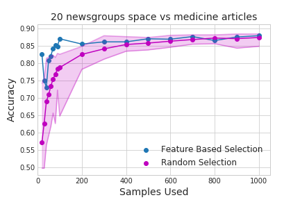

apricot is a package for the greedy selection of representative subsets using submodular selection. apricot's primary focus is the summarization of massive data sets into a smaller subsets for the purpose of training high performing machine learning models in a fraction of the time. To this end, apricot contains implementations of *feature based functions* that scale to millions of samples and *facility location functions* that are less scalable but can be very powerful.

### Installation

(not yet on PyPI or conda)

`pip install apricot` or `conda install apricot`

### Fast subset selection for machine learning models

As data set size increases, so to do the computational requirements to train machine learning models. apricot allows you to select a diverse set of samples that train machine learning models well, with higher accuracy and consistency than randomly selecting a subset would. When using a feature based function on the 20 newsgroups data set, one can train a logistic regression model using only 100 samples and get the same performance as using all 1,187 potential samples, much better than using random sampling.

### Summarizing data sets by selecting examplars

apricot allows you to select exemplar samples using facility location functions. These exemplars can be used for downstream analysis, visualization in the place of large data sets, or as another approach for selecting subsets for training machine learning models.

